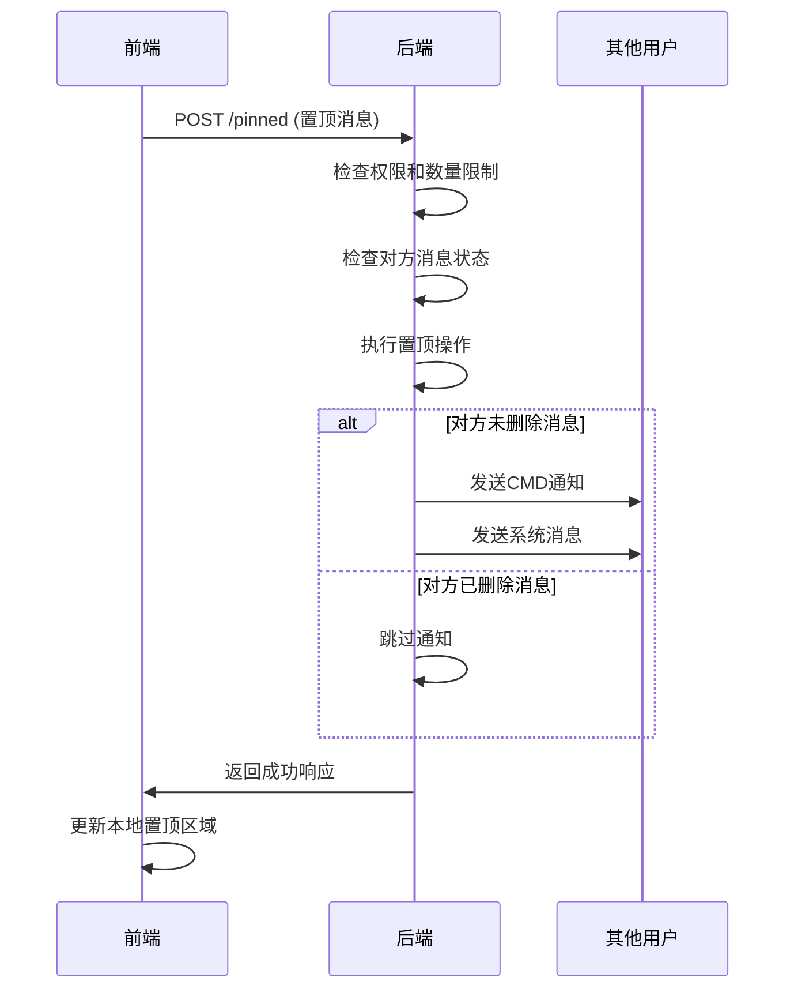
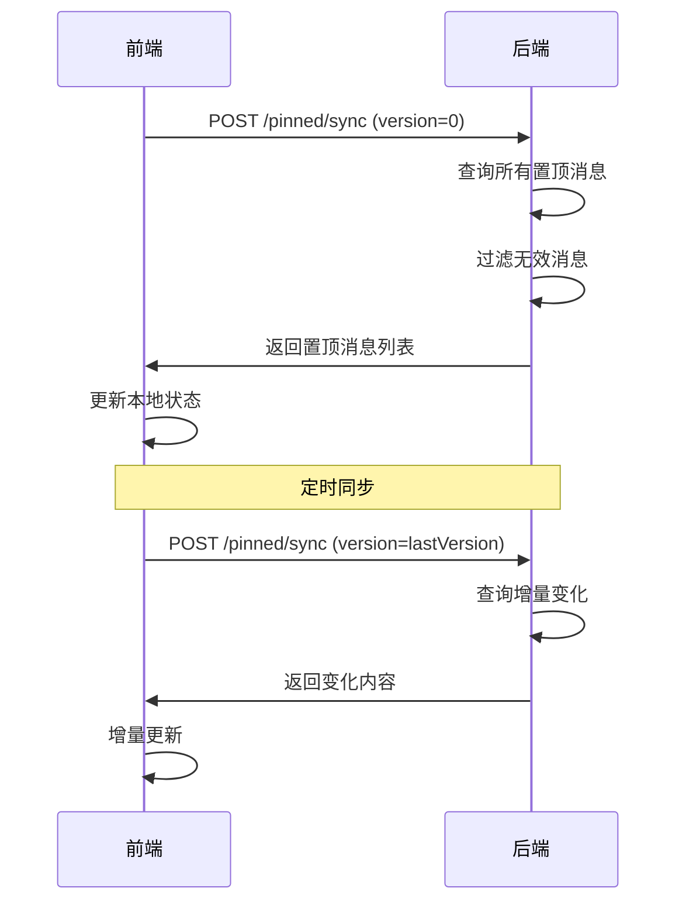

# 置顶消息前端对接接口文档

## 📋 接口概述

本文档详细说明了置顶消息功能的所有接口，包括使用场景、请求参数、响应格式和注意事项。前端开发人员可以根据此文档进行接口对接。

## 🔗 接口列表

### 1. 置顶/取消置顶消息

#### 接口信息
- **接口地址**: `POST /v1/message/pinned`
- **接口描述**: 置顶或取消置顶指定消息
- **认证方式**: 需要登录态（Token）

#### 使用场景

##### **置顶消息**
- 用户长按消息，选择"置顶消息"
- 用户右键消息，选择"置顶消息"
- 用户通过快捷操作置顶消息

##### **取消置顶**
- 用户长按置顶消息，选择"取消置顶"
- 用户点击置顶消息的❎按钮
- 用户通过快捷操作取消置顶

#### 请求参数
```json
{
  "message_id": "1788882133855502336",  // 消息唯一ID（必填）
  "message_seq": 12345,                 // 消息序列号（必填）
  "channel_id": "user123",              // 频道ID（必填）
  "channel_type": 1                     // 频道类型（必填）：1=个人聊天，2=群聊
}
```

#### 响应格式
```json
// 成功响应
{
  "code": 0,
  "msg": "success"
}

// 失败响应
{
  "code": 1001,
  "msg": "该消息不存在或已删除"
}
```

#### 业务逻辑
1. **权限验证**: 个人聊天所有用户可置顶，群聊根据权限设置
2. **数量限制**: 每个频道最多10条置顶消息
3. **智能通知**: 私聊中对方已删除消息时不发送通知
4. **状态同步**: 成功后自动发送CMD通知其他用户

#### 错误码说明
| 错误码 | 错误信息 | 说明 |
|--------|----------|------|
| 1001 | 该消息不存在或已删除 | 消息已被删除或不存在 |
| 1002 | 置顶数量已达到上限 | 频道置顶消息数量超过限制 |
| 1003 | 普通成员不允许置顶消息 | 群聊中普通成员无置顶权限 |
| 1004 | 群不存在或已删除 | 群组状态异常 |

---

### 2. 同步置顶消息

#### 接口信息
- **接口地址**: `POST /v1/message/pinned/sync`
- **接口描述**: 增量同步置顶消息状态变化
- **认证方式**: 需要登录态（Token）

#### 使用场景

##### **实时同步**
- 收到 `CMDSyncPinnedMessage` 命令后自动调用
- 其他用户置顶/取消置顶消息后需要同步

##### **定时同步**
- 应用启动时获取所有置顶消息
- 定期同步确保数据一致性（建议30秒一次）

##### **离线同步**
- 用户重新上线后同步离线期间的变化
- 网络重连后同步最新状态

#### 请求参数
```json
{
  "version": 0,                        // 版本号（必填）：0=获取全部，>0=增量同步
  "channel_id": "user123",             // 频道ID（必填）
  "channel_type": 1                    // 频道类型（必填）：1=个人聊天，2=群聊
}
```

#### 响应格式
```json
{
  "code": 0,
  "msg": "success",
  "data": {
    "pinned_messages": [
      {
        "message_id": "1788882133855502336",
        "message_seq": 12345,
        "channel_id": "user123",
        "channel_type": 1,
        "is_deleted": 0,                // 0=正常，1=已删除
        "version": 1640995200000,
        "created_at": "2024-01-01T00:00:00Z",
        "updated_at": "2024-01-01T00:00:00Z"
      }
    ],
    "messages": [                       // 相关的消息内容（如果需要）
      {
        "message_id": "1788882133855502336",
        "content": "消息内容",
        "type": 1,
        "from_uid": "user123"
      }
    ]
  }
}
```

#### 业务逻辑
1. **版本控制**: 使用version字段进行增量同步
2. **智能过滤**: 自动过滤对方已删除的置顶消息
3. **数据完整性**: 返回置顶状态和消息内容
4. **性能优化**: 支持增量同步，减少数据传输

#### 注意事项
- 首次调用时 `version=0`，获取全部置顶消息
- 后续调用使用上次返回的最大version值
- 如果无变化，`pinned_messages` 为空数组

---

### 3. 清空置顶消息

#### 接口信息
- **接口地址**: `POST /v1/message/pinned/clear`
- **接口描述**: 清空频道内所有置顶消息
- **认证方式**: 需要登录态（Token）

#### 使用场景

##### **用户主动清空**
- 用户点击置顶区域的"清空"按钮
- 用户通过设置页面清空置顶消息

##### **权限控制**
- 个人聊天：用户本人可以清空
- 群聊：仅群主/管理员可以清空

#### 请求参数
```json
{
  "channel_id": "user123",             // 频道ID（必填）
  "channel_type": 1                    // 频道类型（必填）：1=个人聊天，2=群聊
}
```

#### 响应格式
```json
// 成功响应
{
  "code": 0,
  "msg": "success"
}

// 失败响应
{
  "code": 1001,
  "msg": "用户无权清空置顶消息"
}
```

#### 业务逻辑
1. **权限验证**: 检查用户是否有清空权限
2. **批量操作**: 一次性清空所有置顶消息
3. **智能通知**: 根据对方消息状态决定是否通知
4. **状态同步**: 成功后发送CMD通知其他用户

#### 错误码说明
| 错误码 | 错误信息 | 说明 |
|--------|----------|------|
| 1001 | 用户无权清空置顶消息 | 权限不足 |
| 1002 | 频道ID不能为空 | 参数错误 |

---

## 🔄 接口调用流程

### 1. 置顶消息完整流程



### 2. 同步置顶消息流程



## 📱 前端集成建议

### 1. **状态管理**

#### **本地状态**
```javascript
// 置顶消息状态
const pinnedMessages = {
  [channelId]: {
    messages: [],           // 置顶消息列表
    lastVersion: 0,         // 最后同步版本
    lastSyncTime: 0,        // 最后同步时间
    isSyncing: false        // 是否正在同步
  }
}
```

#### **同步策略**
```javascript
// 自动同步策略
const syncStrategy = {
  onStartup: true,          // 启动时同步
  onFocus: true,            // 页面聚焦时同步
  interval: 30000,          // 定时同步间隔（30秒）
  onNetworkChange: true     // 网络变化时同步
}
```

### 2. **错误处理**

#### **网络异常**
- 置顶失败时显示重试按钮
- 同步失败时自动重试（指数退避）
- 离线时缓存操作，上线后同步

#### **权限异常**
- 权限不足时按钮置灰
- 显示权限说明和引导
- 提供联系管理员的方式

### 3. **用户体验**

#### **加载状态**
- 置顶操作时显示加载动画
- 同步过程中显示进度指示
- 避免重复操作

#### **反馈提示**
- 操作成功/失败Toast提示
- 数量限制时的友好提示
- 权限不足时的引导说明

## 🧪 测试用例

### 1. **功能测试**

#### **置顶消息测试**
- [ ] 正常置顶消息
- [ ] 达到数量上限时的处理
- [ ] 权限不足时的处理
- [ ] 消息不存在时的处理

#### **同步测试**
- [ ] 首次同步获取全部
- [ ] 增量同步获取变化
- [ ] 无变化时的响应
- [ ] 网络异常时的重试

#### **清空测试**
- [ ] 有权限用户清空
- [ ] 无权限用户清空
- [ ] 空置顶时的处理

### 2. **边界测试**

#### **参数验证**
- [ ] 空参数处理
- [ ] 无效参数处理
- [ ] 超长参数处理

#### **异常场景**
- [ ] 网络超时处理
- [ ] 服务器异常处理
- [ ] 数据不一致处理

### 3. **性能测试**

#### **并发测试**
- [ ] 多用户同时置顶
- [ ] 大量消息同时置顶
- [ ] 频繁同步的性能

#### **内存测试**
- [ ] 大量置顶消息的内存占用
- [ ] 长时间运行的内存泄漏

## 📊 监控指标

### 1. **接口性能**
- 响应时间统计
- 成功率统计
- 错误率统计

### 2. **用户体验**
- 置顶操作成功率
- 同步延迟时间
- 错误提示频率

### 3. **系统健康**
- 数据库查询性能
- 通知发送成功率
- 内存使用情况

## 🔮 未来扩展

### 1. **功能增强**
- 置顶消息分类
- 置顶消息搜索
- 置顶消息分享

### 2. **性能优化**
- 智能同步策略
- 缓存机制优化
- 批量操作支持

### 3. **用户体验**
- 个性化设置
- 智能推荐
- 操作引导优化

## 📞 技术支持

### 1. **开发支持**
- 接口文档更新
- 示例代码提供
- 问题排查协助

### 2. **测试支持**
- 测试环境搭建
- 测试数据准备
- 测试用例设计

### 3. **运维支持**
- 性能监控
- 错误告警
- 容量规划

---

## 🎯 总结

本文档提供了置顶消息功能的完整接口说明，包括：

1. **三个核心接口**的详细说明
2. **完整的使用场景**和调用流程
3. **前端集成建议**和最佳实践
4. **全面的测试用例**和监控指标
5. **未来扩展方向**和技术支持

前端开发人员可以根据此文档快速完成接口对接，确保功能的正确实现和良好的用户体验。
