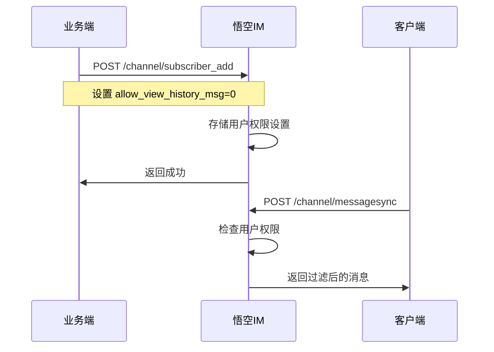

# 悟空IM 业务端对接说明文档

## 概述

本文档详细说明如何将悟空IM集成到您的业务系统中，特别是新增的群组历史消息权限控制功能。

## 核心功能

### 群组历史消息权限控制

悟空IM支持根据业务端配置控制新成员是否能够查看群组的历史消息：

- **允许查看历史消息**：新成员可以看到加入群组前的所有历史消息
- **不允许查看历史消息**：新成员只能看到加入群组后的消息

## 接口对接

### 1. 添加群组成员

**接口地址**: `POST /channel/subscriber_add`

**功能描述**: 将用户添加到群组，并设置历史消息查看权限

**请求参数**:
```json
{
  "channel_id": "group123",           // 群组ID（必填）
  "channel_type": 2,                  // 频道类型：2=群组（必填）
  "subscribers": ["user1", "user2"],  // 要添加的用户ID列表（必填）
  "allow_view_history_msg": 0,        // 历史消息查看权限：0=不允许，1=允许（可选，默认1）
  "reset": 0,                         // 是否重置订阅者：0=不重置，1=重置（可选）
  "temp_subscriber": 0                // 是否临时订阅者：0=否，1=是（可选）
}
```

**权限说明**:
- `allow_view_history_msg = 0`：新成员**不能**查看加入前的历史消息
- `allow_view_history_msg = 1`：新成员**可以**查看所有历史消息
- 如果不传此参数，默认为 `1`（允许查看）

**响应示例**:
```json
{
  "code": 0,
  "msg": "success"
}
```

**使用场景**:
- 创建新群组时添加初始成员
- 邀请新用户加入现有群组
- 批量添加群组成员

### 2. 频道消息同步

**接口地址**: `POST /channel/messagesync`

**功能描述**: 同步指定频道的消息，悟空IM会根据用户的历史消息权限自动过滤

**请求参数**:
```json
{
  "login_uid": "user123",             // 当前登录用户ID（必填）
  "channel_id": "group123",           // 频道ID（必填）
  "channel_type": 2,                  // 频道类型：2=群组（必填）
  "start_message_seq": 100,           // 开始消息序号（可选）
  "end_message_seq": 200,             // 结束消息序号（可选）
  "limit": 50,                        // 每次同步数量限制，最大10000（可选）
  "pull_mode": 0,                     // 拉取模式：0=向下拉取，1=向上拉取（可选）
  "stream_v2": 0                      // 是否使用stream_v2：0=否，1=是（可选）
}
```

**权限控制**:
- 悟空IM会自动检查用户的 `allow_view_history_msg` 设置
- 如果设置为 `0`，只返回用户加入群组后的消息
- 如果设置为 `1`，返回所有历史消息

**响应示例**:
```json
{
  "start_message_seq": 100,
  "end_message_seq": 200,
  "more": 1,
  "messages": [
    {
      "message_id": 123456789,
      "message_seq": 100,
      "from_uid": "user456",
      "channel_id": "group123",
      "channel_type": 2,
      "timestamp": 1640995200,
      "payload": "Hello World"
    }
  ]
}
```

## 业务流程

### 1. 创建群组并添加成员



### 2. 历史消息权限控制流程

1. **业务端配置**：在添加群组成员时设置 `allow_view_history_msg` 参数
2. **悟空IM存储**：悟空IM将权限设置存储到数据库中
3. **消息同步时验证**：用户请求历史消息时，悟空IM自动检查权限
4. **智能过滤**：根据权限设置返回相应的消息范围

## 配置示例

### 场景1：新成员不能查看历史消息

```json
POST /channel/subscriber_add
{
  "channel_id": "work_group",
  "channel_type": 2,
  "subscribers": ["new_employee1", "new_employee2"],
  "allow_view_history_msg": 0
}
```

**效果**：新员工加入工作群后，只能看到加入后的消息，看不到之前的讨论内容。

### 场景2：新成员可以查看历史消息

```json
POST /channel/subscriber_add
{
  "channel_id": "study_group",
  "channel_type": 2,
  "subscribers": ["student1", "student2"],
  "allow_view_history_msg": 1
}
```

**效果**：新学生加入学习群后，可以看到所有历史的学习资料和讨论。

### 场景3：使用默认权限（允许查看）

```json
POST /channel/subscriber_add
{
  "channel_id": "chat_group",
  "channel_type": 2,
  "subscribers": ["friend1", "friend2"]
}
```

**效果**：由于没有指定 `allow_view_history_msg`，悟空IM使用默认值 `1`，新成员可以查看所有历史消息。

## 注意事项

### 1. 权限设置时机
- 权限设置只在**添加订阅者时**生效
- 已存在的成员权限不会自动更新
- 如需修改权限，需要重新添加订阅者

### 2. 兼容性
- 新增字段为可选参数，不影响现有接口调用
- 旧版本数据默认允许查看历史消息
- 支持平滑升级，无需数据迁移

### 3. 性能考虑
- 权限检查在悟空IM内部完成，对业务端无性能影响
- 权限信息缓存在悟空IM中，查询效率高
- 消息过滤在数据库层面完成，避免传输不必要的数据

## 错误处理

### 常见错误码

| 错误码 | 说明 | 解决方案 |
|--------|------|----------|
| 400 | 参数错误 | 检查必填参数是否完整 |
| 404 | 频道不存在 | 确认频道ID和类型是否正确 |
| 500 | 服务器内部错误 | 联系技术支持 |

### 错误响应示例

```json
{
  "code": 400,
  "msg": "channel_id不能为空！"
}
```

## 最佳实践

### 1. 权限设置建议
- **工作群组**：建议设置 `allow_view_history_msg = 0`，避免新员工看到敏感信息
- **学习群组**：建议设置 `allow_view_history_msg = 1`，让新成员了解学习进度
- **社交群组**：根据群组性质灵活设置

### 2. 接口调用建议
- 批量添加成员时，确保所有成员使用相同的权限设置
- 定期检查权限设置是否符合业务需求
- 在用户界面中明确显示群组的历史消息查看权限

### 3. 监控和日志
- 记录权限设置的变更操作
- 监控权限控制功能的正常使用
- 定期分析用户对权限设置的使用情况

## 技术支持

如果您在使用过程中遇到问题，可以通过以下方式获取支持：

- **技术文档**：查看悟空IM官方文档
- **问题反馈**：通过GitHub Issues提交问题
- **技术支持**：联系悟空IM技术支持团队

## 更新日志

| 版本 | 日期 | 更新内容 |
|------|------|----------|
| 1.0.0 | 2024-01-XX | 新增群组历史消息权限控制功能 |
| 1.0.0 | 2024-01-XX | 支持 allow_view_history_msg 参数 |
| 1.0.0 | 2024-01-XX | 自动消息过滤功能 |

---

*本文档会随着功能更新持续维护，请关注最新版本。*
